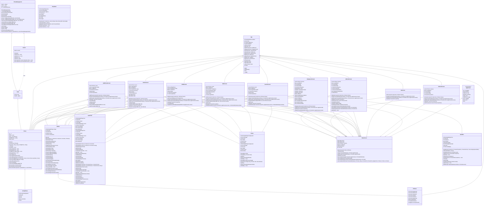

```mermaid
classDiagram
direction TB
    class ConfigPhone {
	    +string operatingSystem
	    +string cpu
	    +int ram
	    +int rom
	    +float screenSize
	    +int pin
    }

    class Phone {
	    -int _id
	    -string _name
	    -string _manufacturer
	    -ConfigPhone _config
	    -string _price
	    +Phone()
	    +Phone(const Phone&)
	    +Phone(int, string, string, ConfigPhone, string)
	    +~Phone()
	    +int getID() const
	    +string getName() const
	    +string getManu() const
	    +ConfigPhone getConfig() const
	    +string getPrice() const
	    +void setID(int id)
	    +void setName(string name)
	    +void setManu(string manufacturer)
	    +void setConfig(string os, string cpu, int ram, int rom, float screenSize, int pin)
	    +void setConfig(ConfigPhone config)
	    +void setPrice(string price)
	    +void insertValue()
	    +void insertToDB(SQLHDBC db)
	    +bool operator==(const Phone)
	    +bool operator!=(const Phone)
	    +friend ostream&amp; operator&lt;&lt;(ostream&amp; os, const Phone)
    }

    class Node {
	    +Phone info
	    +Node* _pNext
    }

    class Iterator {
	    -Node* current
	    +Iterator()
	    +operator*() const
	    +operator->() const
	    +operator++()
	    +operator++(int)
	    +bool operator==(const Iterator& other) const
	    +bool operator!=(const Iterator& other) const
    }

    class PhoneManagement {
	    -Node* _pHead
	    -Node* _pTail
	    -int _numberOfPhones
	    +PhoneManagement()
	    +~PhoneManagement()
	    +Push_back(const Phone&)
	    +RemoveHead()
	    +RemoveTail()
	    +Remove(const Phone&)
	    +Phone* findByID(SQLHDBC db, const int& id)
	    +Phone* findByName(SQLHDBC db, const string& name)
	    +void removePhoneByID(SQLHDBC db, const int& id)
	    +void printPhoneList(SQLHDBC db)
	    +void getPhoneList(SQLHDBC db)
	    +void editPhoneInfor(SQLHDBC db, int id)
	    +void Clear()
	    +Iterator begin()
	    +Iterator end()
	    +Phone& operator[](const int i)
	    +friend ostream&amp; operator&lt;&lt;(ostream&amp; os, const PhoneManagement&amp; ll)
    }

    class AppScreen {
	    INIT_SCREEN
	    ADD_PHONE
	    DISPLAY_LIST
	    SEARCH_PHONE
	    FIND_LIST
	    DELETE_PHONE
	    EDIT_PHONE
	    EDIT_LIST
	    EDIT
    }

    class UITheme {
	    +sf::Color background
	    +sf::Color buttonColor
	    +sf::Color hoverColor
	    +sf::Color textColor
	    +sf::Color textColor1
	    +sf::Color borderColor
	    +float borderRadius
	    +int outlineThickness
	    +unsigned int characterSize
    }

    class Button {
	    -sf::RectangleShape shape
	    -sf::Text text
	    -sf::Font& font
	    -UITheme theme
	    -sf::Color currentColor
	    +Button()
	    +Button(string, sf::Vector2f, sf::Vector2f, sf::Font&, UITheme)
	    +setFont(sf::Font&)
	    +setTextSize(unsigned int)
	    +setTextColor(sf::Color)
	    +setTitle(string)
	    +setBackgroundColor(sf::Color)
	    +setPosition(float, float)
	    +setSize(float, float)
	    +setScale(float, float)
	    +setTexture(sf::Texture&)
	    +int getLocalBoundsWidth()
	    +int getLocalBoundsHeight()
	    +int getPositionX()
	    +int getPositionY()
	    +int getSizeWidth()
	    +int getSizeHeight()
	    +void drawTo(sf::RenderWindow&)
	    +void centerText()
	    +void draw(sf::RenderWindow&)
	    +void update(sf::Vector2f)
	    +bool isClicked(sf::Vector2f)
	    +string getLabel() const
	    +void setButtonColor(sf::Color)
	    +bool isMouseOver(sf::RenderWindow&)
	    +void setOriginToCenter()
	    +void setOriginToCenterForText()
    }

    class InputField {
	    -sf::RectangleShape box
	    -sf::Text text
	    -sf::String content
	    -sf::Text label
	    -sf::RectangleShape cursor
	    -sf::Clock cursorTimer
	    -bool cursorVisible
	    -bool checkLength
	    -bool isSelected
	    -sf::RectangleShape box
	    -sf::Text text
	    -sf::String content
	    -sf::Text label
	    -sf::RectangleShape cursor
	    -sf::Clock cursorTimer
	    -bool cursorVisible
	    -bool checkLength
	    -bool isSelected
	    +InputField(sf::Font&, sf::Vector2f, sf::Vector2f)
	    +InputField(sf::Font&, sf::Vector2f, sf::Vector2f, string)
	    +handleEvent(sf::Event)
	    +getSelected()
	    +setSelected(bool)
	    +contains(sf::Vector2f) const
	    +getText() const
	    +draw(sf::RenderWindow&)
	    +setlabel(string)
	    +setText(string)
	    +setContent(string)
	    +setOutlineBox(sf::Color&)
	    +getLength()
	    +typedOn(sf::Event)
	    +updateCursorBlink()
	    +InputField(sf::Font& font, sf::Vector2f pos, sf::Vector2f size)
	    +InputField(sf::Font& font, sf::Vector2f pos, sf::Vector2f size, string l)
	    +handleEvent(sf::Event event)
	    +getSelected()
	    +setSelected(bool selected)
	    +contains(sf::Vector2f point) const
	    +getText() const
	    +draw(sf::RenderWindow& window)
	    +setlabel(string l)
	    +setText(string t)
	    +setContent(string t)
	    +setOutlineBox(sf::Color& color)
	    +getLength()
	    +typedOn(sf::Event input)
	    +updateCursorBlink()
    }

    class Popup {
	    -sf::RectangleShape background
	    -sf::Text message
	    -sf::Font font
	    -bool visible
	    -sf::Clock clock
	    -float duration
	    -sf::RectangleShape background
	    -sf::Text message
	    -sf::Font font
	    -bool visible
	    -sf::Clock clock
	    -float duration
	    +Popup(float, float)
	    +show(string, sf::Color, float)
	    +update()
	    +draw(sf::RenderWindow&)
	    +isVisible() const
	    +Popup(float width, float height)
	    +show(const string& msg, sf::Color color, float duration)
	    +update()
	    +draw(sf::RenderWindow& window)
	    +isVisible() const
    }

    class BaseScreen {
	    #SQLHENV hEnv
	    #SQLHDBC hDbc
	    #vector~Button~ buttons
	    #Button backButton
	    #UITheme theme
	    #sf::Text title
	    +BaseScreen(sf::Font&, UITheme)
	    +~BaseScreen()
	    +draw(sf::RenderWindow&, sf::Font&, AppScreen&)
	    +pollEvent(sf::RenderWindow&, sf::Event&, AppScreen&)
	    +update(sf::Vector2f)
	    +bool handleClicked(sf::Vector2f, AppScreen&, sf::RenderWindow&)
	    +void drawBack(sf::RenderWindow&)
	    +void drawDefaultScreen(sf::RenderWindow&, AppScreen&, sf::Font&)
	    +void drawBoxWithText(sf::RenderWindow&, sf::Font&, string, sf::Vector2f, sf::Vector2f, unsigned int, sf::Color, sf::Color, sf::Color)
    }

    class InitScreen {
	    +InitScreen(sf::Font& font, UITheme theme)
	    +draw(sf::RenderWindow& window, sf::Font& font, AppScreen& screen)
	    +pollEvent(sf::RenderWindow& window, sf::Event& event, AppScreen& screen)
	    +update(sf::Vector2f mousePos)
    }

    class AddPhoneScreen {
	    -vector~Phone~ pList
	    -vector~InputField~ fields
	    -Button addButton
	    -sf::Vector2f mousePos
	    -Popup popup
	    -sf::Clock inputClock
	    +AddPhoneScreen(sf::Font& font, UITheme theme)
	    +draw(sf::RenderWindow& window, sf::Font& font, AppScreen& screen)
	    +pollEvent(sf::RenderWindow& window, sf::Event& event, AppScreen& screen)
	    +update(sf::Vector2f mousePos)
	    +resetAllFields()
	    +validateFields()
	    +checkFields()
	    +isPhoneIDExisted(SQLHDBC db, int id)
	    +addPhone(SQLHDBC db)
    }

    class DisplayListScreen {
	    -vector~Phone~ phones
	    -float scrollOffsetY
	    -int currentPage
	    -int rowsPerPage
	    -sf::Vector2f mousePos
	    -DisplayMode mode
	    -InputBox manufacturerInput
	    -InputBox orderInput
	    -InputBox priceInput
	    -Button allButton
	    -Button byManufacturerButton
	    -Button byPriceButton
	    -Button findButton
	    -Button backButton
	    -bool showManufacturerInputs
	    -bool showPriceInput
	    -bool showResultTable
	    +DisplayListScreen(sf::Font& font, UITheme theme)
	    +pollEvent(sf::RenderWindow& window, sf::Event& event, AppScreen&)
	    +update(sf::Vector2f mousePos)
	    +draw(sf::RenderWindow& window, sf::Font& font, AppScreen& screen)
    }

    class SearchScreen {
	    -vector~Phone~ pList
	    -Button findButton
	    -vector~InputField~ fields
	    -sf::Vector2f mousePos
	    -Popup popup
	    -sf::Clock inputClock
	    +SearchScreen(sf::Font& font, UITheme theme)
	    +draw(sf::RenderWindow& window, sf::Font& font, AppScreen& screen)
	    +pollEvent(sf::RenderWindow& window, sf::Event& event, AppScreen& screen)
	    +handleFindButton(SQLHDBC db, vector~Phone~& pList)
	    +getPhone()
	    +update(sf::Vector2f mousePos)
	    +handleClicked(sf::Vector2f mousePos, AppScreen& screen, sf::RenderWindow& window)
    }

    class FindListScreen {
	    -vector~Phone~ phones
	    -float scrollOffsetY
	    -int currentPage
	    -int rowsPerPage
	    -sf::Vector2f mousePos
	    +FindListScreen(sf::Font& font, UITheme theme)
	    +draw(sf::RenderWindow& window, sf::Font& font, AppScreen& screen)
	    +pollEvent(sf::RenderWindow& window, sf::Event& event, AppScreen& screen)
	    +update(sf::Vector2f mousePos)
	    +setPhones(const vector~Phone~& phones)
    }

    class DeleteScreen {
	    -vector~Phone~ pList
	    -Button deleteButton
	    -Button findButton
	    -vector~InputField~ fields
	    -sf::Vector2f mousePos
	    -Popup popup
	    -sf::Clock inputClock
	    -SQLHENV hEnv
	    -SQLHDBC hDbc
	    +DeleteScreen(sf::Font& font, UITheme theme)
	    +draw(sf::RenderWindow& window, sf::Font& font, AppScreen& screen)
	    +pollEvent(sf::RenderWindow& window, sf::Event& event, AppScreen& screen)
	    +validateFields()
	    +handleFindButton(SQLHDBC db)
	    +update(sf::Vector2f mousePos)
	    +deletePhone(SQLHDBC db, const int& id)
    }

    class EditScreen {
	    -vector~Phone~ pList
	    -Button findButton
	    -vector~Button~ editButton
	    -vector~InputField~ fields
	    -sf::Vector2f mousePos
	    -Popup popup
	    -sf::Clock inputClock
	    +EditScreen(sf::Font& font, UITheme theme)
	    +draw(sf::RenderWindow& window, sf::Font& font, AppScreen& screen)
	    +pollEvent(sf::RenderWindow& window, sf::Event& event, AppScreen& screen)
	    +handleFindButton(SQLHDBC db, vector~Phone~& pList)
	    +getPhone()
	    +update(sf::Vector2f mousePos)
	    +handleClicked(sf::Vector2f mousePos, AppScreen& screen, sf::RenderWindow& window)
    }

    class EditListScreen {
	    -vector~Phone~ phones
	    -float scrollOffsetY
	    -int currentPage
	    -int rowsPerPage
	    -sf::Vector2f mousePos
	    -sf::Clock clickClock
	    -sf::Vector2f lastClickPos
	    -bool waitingForDoubleClick
	    -int indexPhone
	    +EditListScreen(sf::Font& font, UITheme theme)
	    +draw(sf::RenderWindow& window, sf::Font& font, AppScreen& screen)
	    +pollEvent(sf::RenderWindow& window, sf::Event& event, AppScreen& screen)
	    +update(sf::Vector2f mousePos)
	    +setPhones(const vector~Phone~& list)
	    +handleMouseClick()
	    +handleScroll(float delta)
	    +handleKeyboard(sf::Keyboard::Key key)
	    +drawTableFrame(sf::RenderWindow& window)
	    +drawTableContent(sf::RenderWindow& window, sf::Font& font)
	    +drawPageIndicator(sf::RenderWindow& window, sf::Font& font)
	    +getIndex() const
    }

    class EditExecute {
	    -Phone editingPhone
	    -vector~InputField~ fields
	    -Button saveButton
	    -Popup popup
	    -sf::Vector2f mousePos
	    -sf::Clock inputClock
	    +EditExecute(sf::Font& font, UITheme theme)
	    +setPhoneToEdit(const Phone& phone)
	    +draw(sf::RenderWindow& window, sf::Font& font, AppScreen& screen)
	    +pollEvent(sf::RenderWindow& window, sf::Event& event, AppScreen& screen)
	    +update(sf::Vector2f mousePos)
	    +resetAllFields()
	    +updatePhoneInDatabase(SQLHDBC db, AppScreen& screen)
    }

    class App {
	    -sf::RenderWindow window
	    -sf::Font font
	    -sf::Texture bgTexture
	    -sf::Sprite bgSprite
	    -UITheme theme
	    -InitScreen* init
	    -AddPhoneScreen* addScreen
	    -DisplayListScreen* displayScreen
	    -SearchScreen* searchScreen
	    -FindListScreen* findScreen
	    -DeleteScreen* deleteScreen
	    -EditScreen* editScreen
	    -EditListScreen* editListScreen
	    -EditExecute* editExec
	    -AppScreen currentScreen
	    -sf::Event event
	    -SQLHENV hEnv
	    -SQLHDBC hDbc
	    -vector~Phone~ pList
	    -int index
	    +App()
	    +initWindow()
	    +run()
	    +~App()
    }

    class InputBox {
	    -sf::RectangleShape box
	    -sf::Text text
	    -sf::Font& font
	    -bool isActive
	    -string placeholder
	    -bool showingPlaceholder
	    -string Text
	    -sf::Text TextDisplay
	    +InputBox(sf::Font& font, sf::Vector2f position, sf::Vector2f size, const string& placeholder)
	    +setPosition(float x, float y)
	    +handleEvent(const sf::Event& event)
	    +update(const sf::Vector2f& mousePos)
	    +getText() const
	    +setText(const string& str)
	    +isClicked(const sf::Vector2f& mousePos) const
	    +activate()
	    +deactivate()
	    +handleTextInput(sf::Uint32 unicode)
	    +getIsActive() const
	    +pollEvent(sf::RenderWindow& window, sf::Event& event)
    }

    class Dropdown {
	    -sf::RectangleShape box
	    -sf::Text selectedText
	    -vector~sf::Text~ options
	    -sf::Font& font
	    -bool isOpen
	    -int selectedIndex
	    -float width
	    -float height
	    +Dropdown(sf::Font& font, vector~string~ items, float width, float height)
	    +setPosition(float x, float y)
	    +update(sf::Vector2f mousePos, bool mouseClicked)
	    +getSelectedIndex() const
	    +getSelectedItem() const
    }


	<<enumeration>> AppScreen

    Phone o-- ConfigPhone
    PhoneManagement o-- Node
    PhoneManagement o-- Iterator
    Node o-- Phone
    Iterator ..> Node : uses
    Button o-- UITheme
    InitScreen --|> BaseScreen
    AddPhoneScreen --|> BaseScreen
    DisplayListScreen --|> BaseScreen
    SearchScreen --|> BaseScreen
    FindListScreen --|> BaseScreen
    DeleteScreen --|> BaseScreen
    EditScreen --|> BaseScreen
    EditListScreen --|> BaseScreen
    EditExecute --|> BaseScreen
    App o-- InitScreen
    App o-- AddPhoneScreen
    App o-- DisplayListScreen
    App o-- SearchScreen
    App o-- FindListScreen
    App o-- DeleteScreen
    App o-- EditScreen
    App o-- EditListScreen
    App o-- EditExecute
    App o-- UITheme
    App o-- Phone
    AddPhoneScreen --|> BaseScreen
    AddPhoneScreen o-- InputField
    AddPhoneScreen o-- Button
    AddPhoneScreen o-- Popup
    AddPhoneScreen o-- Phone
    DeleteScreen --|> BaseScreen
    DeleteScreen o-- InputField
    DeleteScreen o-- Button
    DeleteScreen o-- Popup
    DeleteScreen o-- Phone
    DisplayListScreen --|> BaseScreen
    DisplayListScreen o-- Phone
    DisplayListScreen o-- InputBox
    DisplayListScreen o-- Button
    EditExecute --|> BaseScreen
    EditExecute o-- InputField
    EditExecute o-- Button
    EditExecute o-- Popup
    EditExecute o-- Phone
    EditListScreen --|> BaseScreen
    EditListScreen o-- Phone
    EditScreen --|> BaseScreen
    EditScreen o-- Phone
    EditScreen o-- Button
    EditScreen o-- InputField
    EditScreen o-- Popup
    InitScreen --|> BaseScreen
    FindListScreen --|> BaseScreen
    SearchScreen --|> BaseScreen
    SearchScreen o-- Phone
    SearchScreen o-- Button
    SearchScreen o-- InputField
    SearchScreen o-- Popup
    AppScreen o-- BaseScreen
```
